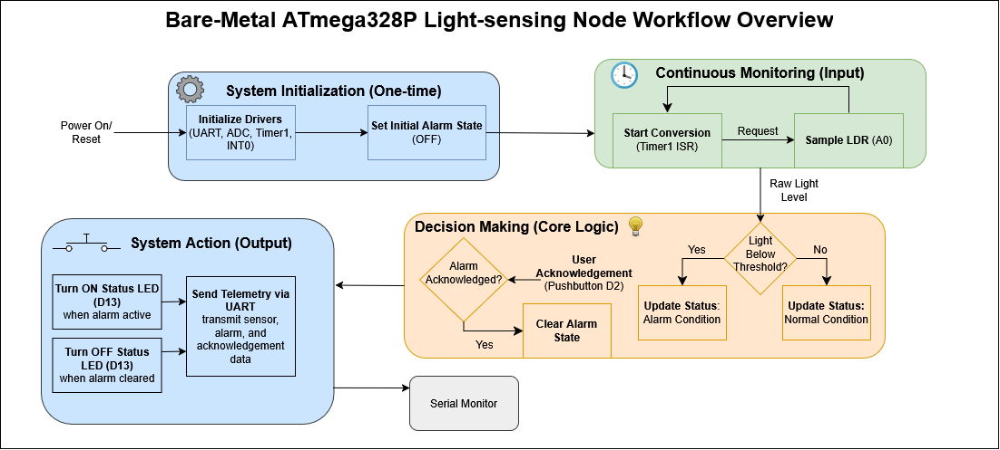

# Bare-Metal ATmega328P Light-sensing Node
A lightweight, non-blocking environmental monitoring system built in bare-metal C on the ATmega328P (Arduino Uno hardware). Designed without high-level Arduino libraries or blocking loops (`_delay_ms()`), utilizing direct memory-mapped register manipulation, hardware interrupts, and cooperative multi-tasking.

## Serial Demo

## Circuit Demo

## Key Engineering Highlights

- Non-Blocking Hardware Timing: Configured Timer1 in CTC mode (`TCCR1B`) with a calculated compare value (OCR1A = 15624) to trigger 1-second sampling interrupts (`TIMER1_COMPA_vect`). This completely eliminates blocking delay routines like `_delay_ms()` and frees the CPU for background processing.

- Bare-Metal Analog Acquisition: Managed 10-bit light sensing by configuring reference voltage and channel 0 selection in `ADMUX`, setting the ADC prescaler to 128 via `ADCSRA` for optimal 125 kHz sampling frequency, and reading raw conversion data directly from the ADC register pair.

- Hardware Interrupt Handling: Configured INT0 (PD2) via `EICRA` for falling-edge detection and enabled vector interrupts through `EIMSK`. Cleared pending interrupt flags on startup by writing to `EIFR` to prevent ghost triggers on power-up.

- Register-Level UART Telemetry: Implemented serial communications without external libraries by configuring UBRR0 for target 9600 baud rate generation, enabling transmission via `UCSR0B`, and writing character payloads directly to the transmit buffer register `UDR0`.

- Deterministic Cooperative Architecture: Built an event-driven main loop that monitors atomic state flags toggled exclusively inside ISR routines (`ISR(INT0_vect)` and `ISR(TIMER1_COMPA_vect)`), keeping execution deterministic and preventing race conditions.

## High-level Workflow Chart

## Hardware Specifications & Pin Mapping

| Component | ATmega328P Pin | AVR Register | Functional Description |
| --- | --- | --- | --- |
| LDR Photoresistor | Pin A0 | ADC0 (ADMUX) | Analog light sensing (10-bit resolution) |
| Pushbutton Switch | Pin D2 | PD2 (INT0) | Falling-edge external interrupt for alarm acknowledge |
| Status LED | Pin D13 | PB5 (PORTB) | Digital output indicating low-light threshold state |

*Note: UART telemetry runs internally over onboard USB connection*

## Schematic & Breadboard Build

  
  
  

## Build & Deployment

This project is configured for the PlatformIO IDE extension in Visual Studio Code.

### Prerequisites

1. Visual Studio Code installed
2. Platform.io extension installed

### Flashing

#### Using the terminal method

1. Open Project: Launch VS Code and ensure the terminal path is in the root directory (CLI should then be preconfigured for `pio` use).
2. Compile, Flash, and Monitor: Run command `pio run -t upload -t monitor` to build the firmware, flash the firmware, and open the monitor for live log output.

#### Using non-terminal method

1. Open Project: Launch VS Code and open the root project directory (File -> Open Folder). Ensure platformio.ini is in the root directory for PlatformIO automatic detection.
2. Compile Firmware: Build the firmware (click the Checkmark icon on the bottom PlatformIO status bar) to run avr-gcc and compile the executable. If using the terminal, run `pio run` to compile.
3. Flash Board: Plug the Arduino Uno into your computer via USB and upload the firmware (click the Right Arrow icon on the bottom status bar to upload the binary). If using the terminal, run 
4. View Telemetry: View the serial monitor to see the live log output (click the Plug icon on the status bar to open the built-in Serial Monitor).

## References & Resources

* [Arduino UNO R3 Pinout Sheet](https://docs.arduino.cc/resources/pinouts/A000066-full-pinout.pdf)
* [ATmega328P Datasheet](https://ww1.microchip.com/downloads/en/DeviceDoc/Atmel-7810-Automotive-Microcontrollers-ATmega328P_Datasheet.pdf)
* [AVR-LibC Reference Manual](https://www.gnu.org/software/avr-libc/user-manual/)

*Note: Gemini 3.6 Thinking was used for pretesting and sanitizing code, as well as formatting improvements*
