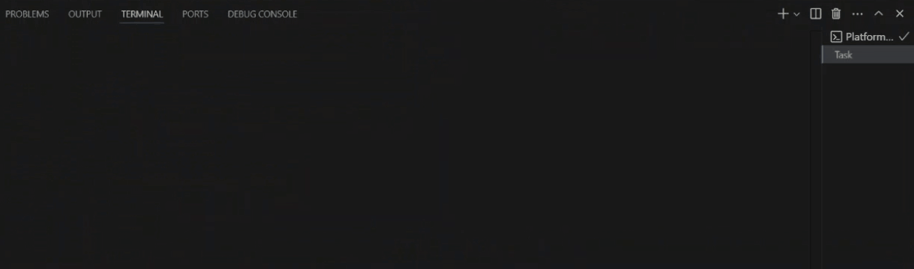
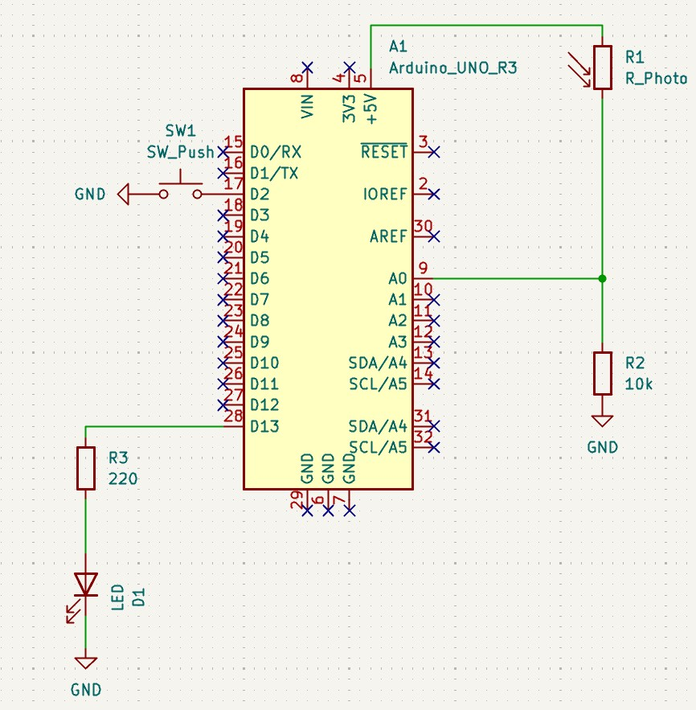
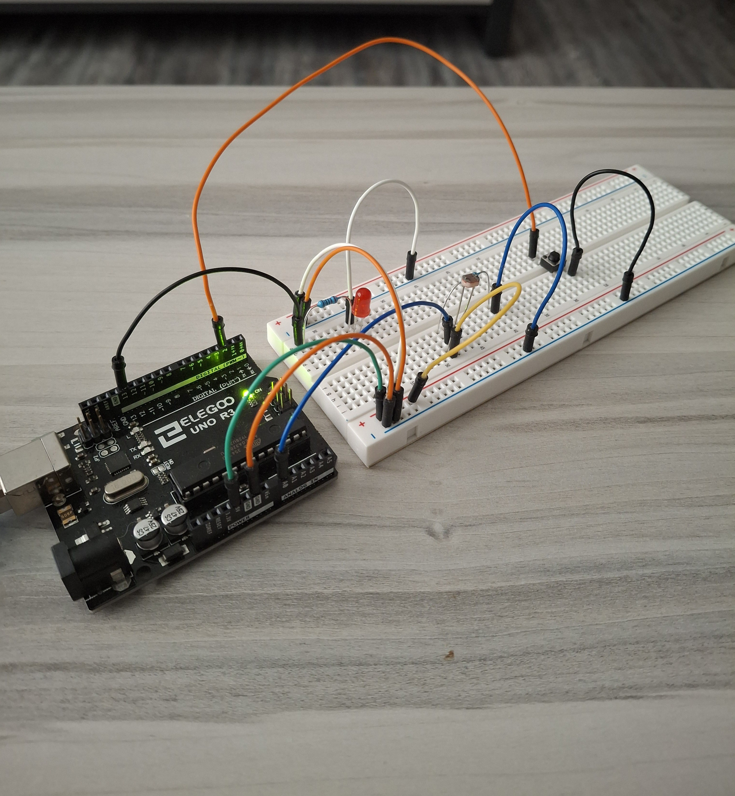
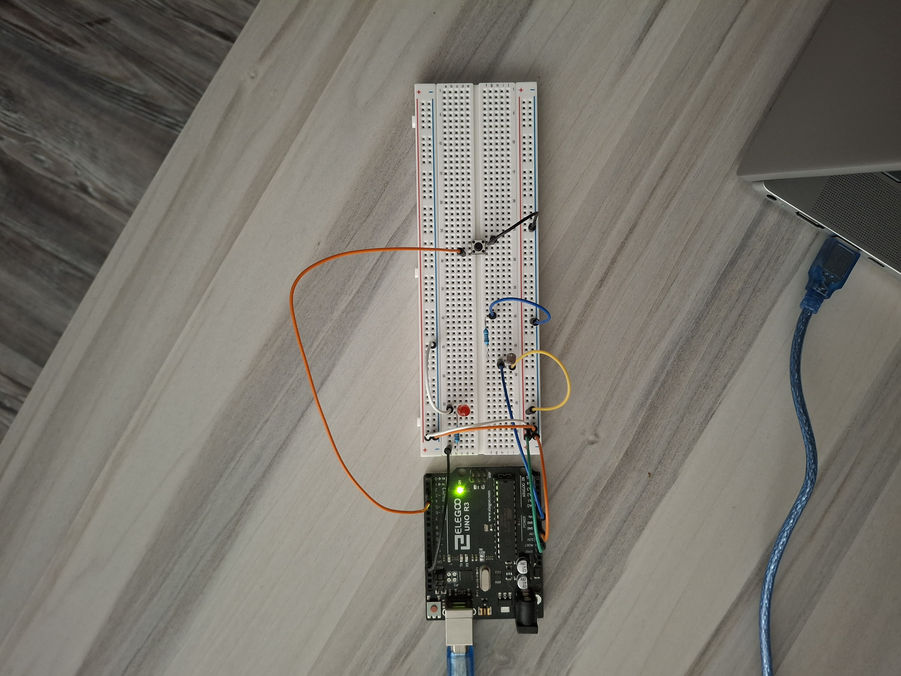

# Bare-Metal ATmega328P Environmental Sensor
A lightweight, non-blocking environmental monitoring system built in bare-metal C on the ATmega328P (Arduino Uno hardware). Designed without high-level Arduino libraries or blocking loops (_delay_ms()), utilizing direct memory-mapped register manipulation, hardware interrupts, and cooperative multi-tasking.

## Serial Demo

## Circuit Demo

## Key Engineering Highlights

- Zero-Blocking Architecture: Uses Timer1 in Clear Timer on Compare (CTC) mode for exact 1-second sampling intervals, freeing the CPU core for event handling.

- Hardware Interrupt Driven: Pushbutton input managed via INT0 external interrupt with hardware flag clearing (EIFR) to eliminate initialization noise and ghost triggers.

- Direct Register Control: Built completely from scratch using avr-libc register definitions for GPIO, ADC, Timer1, and UART peripherals.

- Cooperative Multitasking: Main loop processes atomic state flags set by hardware ISRs, achieving deterministic timing and high execution efficiency.

## Hardware Specifications & Pin Mapping

| Component | ATmega328P Pin | AVR Register | Functional Description |
| --- | --- | --- | --- |
| LDR Photoresistor | Pin A0 | ADC0 (ADMUX) | Analog light sensing (10-bit resolution) |
| Pushbutton Switch | Pin D2 | PD2 (INT0) | Falling-edge external interrupt for alarm acknowledge |
| Status LED | Pin D13 | PB5 (PORTB) | Digital output indicating low-light threshold state |

*Note: UART telemetry runs internally over onboard USB connection*

## Schematic & Breadboard Build

  
  
  

## Build & Deployment

This project is configured for the PlatformIO IDE extension in Visual Studio Code.

### Prerequisites

1. Visual Studio Code installed
2. Platform.io extension installed

### Flashing

1. Open Project: Launch VS Code and open the root project directory (File -> Open Folder). PlatformIO will automatically detect platformio.ini.
2. Compile Firmware: Build the firmware (click the Checkmark icon on the bottom PlatformIO status bar) to run avr-gcc and compile the executable.
3. Flash Board: Plug the Arduino Uno into your computer via USB and upload the firmware (click the Right Arrow icon on the bottom status bar to upload the binary).
4. View Telemetry: View the serial monitor to see the live log output (click the Plug icon on the status bar to open the built-in Serial Monitor).

## References & Resources

* [Arduino UNO R3 Pinout Sheet](https://docs.arduino.cc/resources/pinouts/A000066-full-pinout.pdf)
* [ATmega328P Datasheet](https://ww1.microchip.com/downloads/en/DeviceDoc/Atmel-7810-Automotive-Microcontrollers-ATmega328P_Datasheet.pdf)
* [AVR-LibC Reference Manual](https://www.gnu.org/software/avr-libc/user-manual/)
